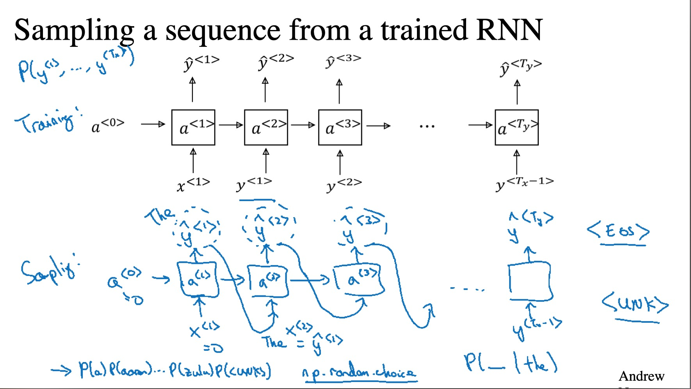

# sequence model 
序列模型的所处理的数据就如名字所示：「序列」化的数据，单个的数据与前后的数据有着较为紧密的关系；常常是从这些有邻近关系的数据中发掘出显式的关系。常见的应用场景：语言翻译、运动的行为状态的识别、语音识别、sentiment classification（评价的分辨）、语句中的人名的识别等。

总的来说，sequence model是更加普遍的类型，它更近直觉：事物的发展具有连续性，由连续事物的各个部分来决定这个事物的本质。

## RNN基本模型

**特征** 处理具有序列结构或关系的数据，处理整体的与局部的关系。

**RNN的几种结构**
many to one：sentiment classification；one to many：生成音乐；one to one（不长用）；many to many（常用、常见的模型）

其中one to many比较难以理解，但是可以利用它来生成一段音乐，输入关键的信息输出相关的音乐。

而many to many则存在x与y长度不一样和一样两种类型，其中长度不一的类型常常会用在机器翻译中,常将x部分称为encoder， y部分称为decoder。

## Rnn notion

- the one example situation:

$x^{<t>}​$: indice the position of the sequence.

$T_{x}$:  the lenth of input sequence.

$T_{y}$ : the lenth of output sequence.

$y^{<t>}$ : the output of the indice t in the sequence.

- the mutilple examples situation:

  $x^{(i)<t>}$: the $t$ position in $ith$ sequence.

  $y^{(i)<t>}$: *t* position in $ith$ sequence.

  $T_{x}^{<i>}​$:length of $ith​$ sequence.

   $T_{y}^{<i>}$:length of $ith$ sequence.

  ### why Rnn

  比较一般的neural network model 在处理具有序列化数据时不能满足需求：

  - 在不同的样例中输入与输出长度不一。
  - 一般的NN不会分享前几个序列的信息。就像convolution nn中需要不同部分的像素的信息相互共享才能够识别出总体的信息是什么。

  rnn 设计的模型就够就能够实现局部序列信息的共享。

  ## Rnn forward propagation

  

  

其中$a^{<i>}$作为信息分子不断结合当前节点的信息之后向前传递；$y^{<i>}$通过当前节点及其之前的信息来的到当前 $ith$ 位置的输出结构，依此向前传递。

## Language model

- 语言模型是什么？

  语言模型「Language model」实现判断一个句子它到底是什么。

  > 语音识别中来举例，语句x可能是：
  >
  > the apple and pair salad.
  >
  > the apple and pear salad.
  >
  > 语言模型就是要实现将判断x为那种句子的可能性最高，既是$MAXp(x) $。
  >
  > 也即是计算出$p(sentence) = ?$ 其中sentence是通过序列模型所生成的$y^{(1)} y^{(2)}y^{(3)}...y^{(t)}$ 也就是可能的句子。  

  广义来说就是预测在当前时间点听到了部分信息后，预测出后面可能的信息。

## RNN model

RNN model 对language sequence的应用例子。

$ y^{<i>}$ 根据当前的输入 $x^{<i>}$ 以及之前的信息，利用 softmax 函数来预测当前条件下 $y^{<i>}$可能的值是什么，以及概率。 也就是 $p(y^{<i>}|y^{<1>},…,y^{<i-1>})$ ，并且 $x^{<i>} = y^{<i-1>}$ ，也就是利用利用t位置前的信息来判读预测下一位置的信息。

其中loss function为soft max 的loss function。

## sampling novel sequence

### words model

在训练完的模型后来实现sampling a sequence from a trained RNN.应用的场景就是根据已有的模型来自己书写新的内容，如给予训练的语料来写新闻，写诗等。

如上所示的在训练好的模型后来进行采样生成新的sequence。

### character model

除了单词的模型，还有字符级的模型。字符模型的优缺如下：

pro：

- 不会出现unknown token「陌生词」

cons：

- 需要寻来呢的序列太长，训练更加花费资源，训练的难度的复杂度也更大。

## Vanishing gradients with RNNs

Rnn中如果句子中部分的依赖过长，在训练由于会存在gradient vanishing 问题，不能很好的记录依赖的距离过长的句子。

- 当遇上了gradient exploding，可以使用gradient clipping来解决：观察gradient vector当其中有gradient 大于阀值对gradient过大的值进行手动的减小，避免gradient exploding。
- 而gradient vanishing着不是那么好解决，这就需要借助其他的工具：GRU与LSTM

## GRU

解决gradient vanishing的问题，当序列模型中存在长依赖的特性，需要有有效的方法来记住一些**前期**特性，它在后期具有参考的价值。

GRU设计了cell来记忆当前位置的信息，作为后续信息更新的参考，解决长依赖的问题与gradient vanishing的问题。

基本的RRU的简化结构如下：

利用$\tilde C^{<t>}$待更新「中间」单元与$\Gamma_{u}$ 即update gate共同来决定是否更新记忆单元$C^{<t>}$ 以及如何更新。

在 $C^{<t>} = \Gamma_u * \tilde C^{<t>} + (1- \Gamma_u) * C^{<t-1>}$ 中，update gate 来决定是否进行更新，可以一直记忆到不需要cell t 为止。

在此基础上，常用的是更为完整的GRUmodel， 其中增加了 relationship gate

$\Gamma_r$ 实现当前的位置数据与前一个记忆单元的关系，作为$\tilde C^{<t>}$ 「中间待更新值」的评判「权重」、信息。 

## LSTM

实际上LSTM是GRU的原始版本，LSTM发明的时间前与GRU。

如上对比：

- LSTM有三个门分别 update gate、 forget gate、 output gate。
- GRU则是在LSTM的基础上简化为一个 update gate， 此外添加 relation gate。

同样LSTM也存在不同的变种版本， 较常见的 people connection 

- 相比较GRU ，LSTM 模型中的cell 在网络中一直传递，其记忆的效果明显是强于GRU。
- 但是LSTM的结构过于复杂，这也成为了它的劣势：训练难度上比较大，计算复杂度大。
- GRU即是综合考虑了这些因素，在抛弃可接受的损失减小了网络的复杂度，更加适合来训练更广更深的网络。

**LSTM 变种 people connection** 

people connection 在LSTM基础上在三门中加入了上一个记忆单元「$C^{<t-1>}$」的影响。实现之后，每个position的gate也是只会受当前position的cell 的影响。

## Bidirectional Rnn

在某些场景中序列中的信息在位置t不仅依赖t之前位置的信息，也依赖t 之后的位置的信息，在做预测判断时也就要考虑前后两个方向的信息，BRNN基于这样的应用产生。

预测不同的两个语句中Teddy的意思，要在两个方向上来考虑，向前或者向后，也就是需要知道「未来的信息」。getting messeage from future.

BRNN 基本的模型，其中的RNN单元可以是任何的RNN单元 ，如：GRU、LSTM。forward propagation在两个方向同时进行，头与尾！

- 在NLP中BRNN 使用LSTM较多，使用BRNN的弊端也比较明显：要在整个序列完整输入后才能进行计算得出结果。

  ## Deep RNN

  

对于一些复杂的场景与应用，则需要深度更加深的网络也即 是Depp RNN。由于Rnn的训练难度与计算成本一般较高，其结深度一般不会太深。

- deep RNN 深度一般不会太深，三层比价常见；更多的深层模型是在预测输出上「做文章」：将输出层「分离」出来进行单独的设计较深的网络。
- 当然RNN的模块可以是GRN、LSTM或其他的单元。
- 也可以是deep BRNN， 但是这样的结构训练难度特别大，并且计算量也较大。

